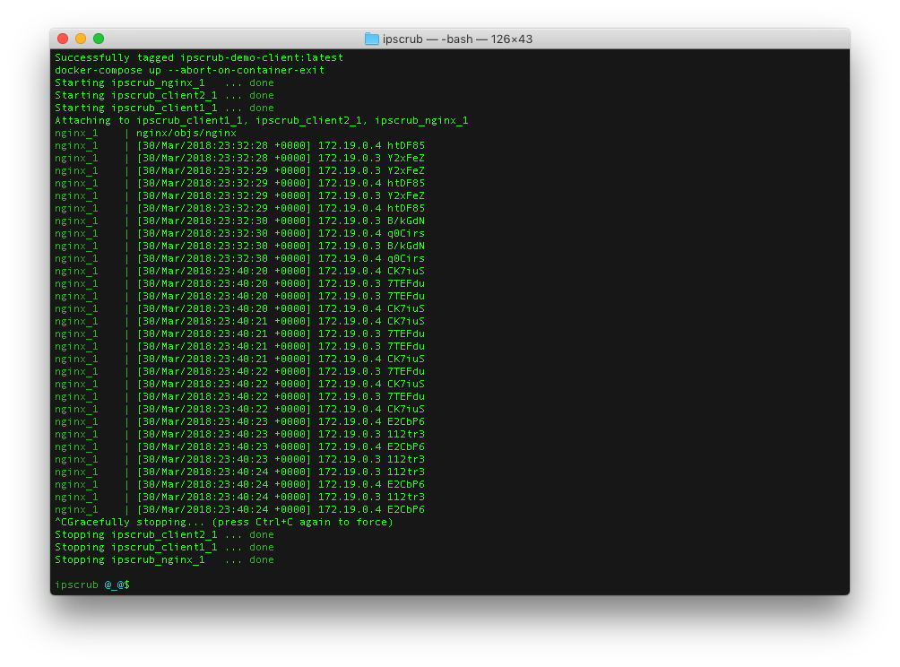

# `ipscrub`

`ipscrub` is an IP address anonymizer for [nginx](https://www.nginx.com) log files. It's an nginx module that generates an IP-based hash. You can use this hash to link requests from the same source, without identifying your users by IP address.

## TOC

* [Security Model](#security-model)
* [Threat Model](#threat-model)
* [Usage](#usage)
* [Changelog](#changelog)
* [GDPR](#gdpr)
* [YAGNI](#yagni)
* [License](#license)

## Security Model

1. On initialization, and again every `PERIOD`, generate `salt` using 128bits from `arc4random_buf()`.
2. On each request, generate masked IP address as `HASH(salt ++ IP address)`.
3. Log masked IP address.

`ipscrub` uses `arc4random` to generate random nonces (see [Theo de Raat's talk on arc4random](https://www.youtube.com/watch?v=aWmLWx8ut20) for a great overview). On Linux this requires installing [libbsd](https://libbsd.freedesktop.org/wiki/) (package libbsd-dev on Ubuntu/Debian). 

ALSO NOTE: the generated hash WILL change on each `PERIOD` transition, so you will only have continuity within each `PERIOD`. But because users can transition between networks at any time (e.g. wifi -> cellular), you'd have this type of issue even if you were storing raw IPs.

## Threat Model

1. Government presents you with an IP address and demands identification of user corresponding to that address.
2. Government identifies a user e.g. by email address, and demands IP address they had at some point in time.

In threat scenario (1), the goal is to compute the masked IP corresponding to a target IP address. This will only be possible if the demand is made before the end of the current `PERIOD`.

Scenario (2) is defended against because the server operator does not know the salt, and cannot infer it based on the request timestamp, because the salt is generated from a nonce that is only stored in memory. The server operator would have to be an accomplice in this case, but that is more simply accomplished by the server operator just recording the unmasked IP. So this security/threat model does not defend against a malicious server operator, but that is not the point. It does defend against an honest server operator being compelled in threat scenarios (1) and (2).

## Usage

### Installation

#### Building From Source

`ipscrub` can be built statically with nginx or as a [dynamic module](https://www.nginx.com/blog/compiling-dynamic-modules-nginx-plus/). See the `Makefile` for examples of both ways.

#### Configuration

In your `nginx.conf`,

1. At the top-level, load the module by adding the line `load_module ngx_ipscrub_module.so;` (NOTE: only if you built as a dynamic module).
1. Set `ipscrub_period_seconds <NUM SECONDS PER PERIOD>;` (optional).
1. In your `log_format` directives, replace `$remote_addr` with `$remote_addr_ipscrub`.
1. Reload your nginx config.

**NOTE**: nginx may still leak IP addresses in the error log. If this is a concern, disable error logging or wipe the log regularly.

#### Running Tests

`make test`

#### Checking for Updates

`make check-up-to-date`

This will have a non-zero exit code if you aren't up-to-date, so you can automate regular checks.

### Changelog

- 1.0.1 fixed vulnerability to unmasking hashed IPs (thanks to [@marcan](https://github.com/marcan))
- 1.0.0 initial release

## GDPR

[GDPR](https://www.eugdpr.org) goes into effect on May 25, 2018. It legislates the handling of personal data about your users, including IP addresses.

From https://www.eugdpr.org/gdpr-faqs.html:

    What constitutes personal data?

    Any information related to a natural person or ‘Data Subject’, that can be used to directly or indirectly identify the person. It can be anything from a name, a photo, [...], or a computer IP address.

The hashes generated by `ipscrub` let you correlate nginx log entries by IP address, without actually storing IP addresses, reducing your GDPR surface area.

## YAGNI

Why are you logging IP addresses anyway? [You Ain't Gonna Need It](https://en.wikipedia.org/wiki/You_aren%27t_gonna_need_it). If you want geolocation, just use [MaxMind's GeoIP module](https://nginx.org/en/docs/http/ngx_http_geoip_module.html) in conjunction with `ipscrub`.

## License

Copyright 2018 [Mason Simon](https://masonsimon.com)

Redistribution and use in source and binary forms, with or without modification, are permitted provided that the following conditions are met:

1. Redistributions of source code must retain the above copyright notice, this list of conditions and the following disclaimer.

2. Redistributions in binary form must reproduce the above copyright notice, this list of conditions and the following disclaimer in the documentation and/or other materials provided with the distribution.

3. If you use this module in a production service that has an associated privacy policy, that privacy policy must include this text "This service uses [ipscrub](http://www.ipscrub.org) (http://www.ipscrub.org)." or similar text in the same spirit, which includes that link to http://www.ipscrub.org.

THIS SOFTWARE IS PROVIDED BY THE COPYRIGHT HOLDERS AND CONTRIBUTORS "AS IS" AND ANY EXPRESS OR IMPLIED WARRANTIES, INCLUDING, BUT NOT LIMITED TO, THE IMPLIED WARRANTIES OF MERCHANTABILITY AND FITNESS FOR A PARTICULAR PURPOSE ARE DISCLAIMED. IN NO EVENT SHALL THE COPYRIGHT HOLDER OR CONTRIBUTORS BE LIABLE FOR ANY DIRECT, INDIRECT, INCIDENTAL, SPECIAL, EXEMPLARY, OR CONSEQUENTIAL DAMAGES (INCLUDING, BUT NOT LIMITED TO, PROCUREMENT OF SUBSTITUTE GOODS OR SERVICES; LOSS OF USE, DATA, OR PROFITS; OR BUSINESS INTERRUPTION) HOWEVER CAUSED AND ON ANY THEORY OF LIABILITY, WHETHER IN CONTRACT, STRICT LIABILITY, OR TORT (INCLUDING NEGLIGENCE OR OTHERWISE) ARISING IN ANY WAY OUT OF THE USE OF THIS SOFTWARE, EVEN IF ADVISED OF THE POSSIBILITY OF SUCH DAMAGE.

### Alternative Licensing

If you would like to use `ipscrub` without attribution in your privacy policy, or to discuss custom development, get in touch and we can work something out (email address is in my GitHub profile, [@masonicb00m](https://twitter.com/masonicb00m) on Twitter).